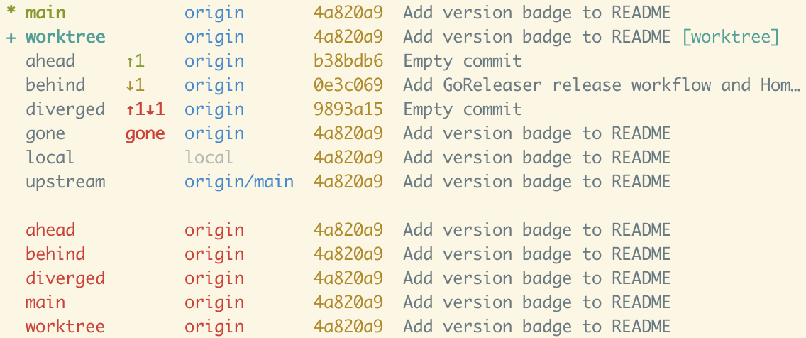
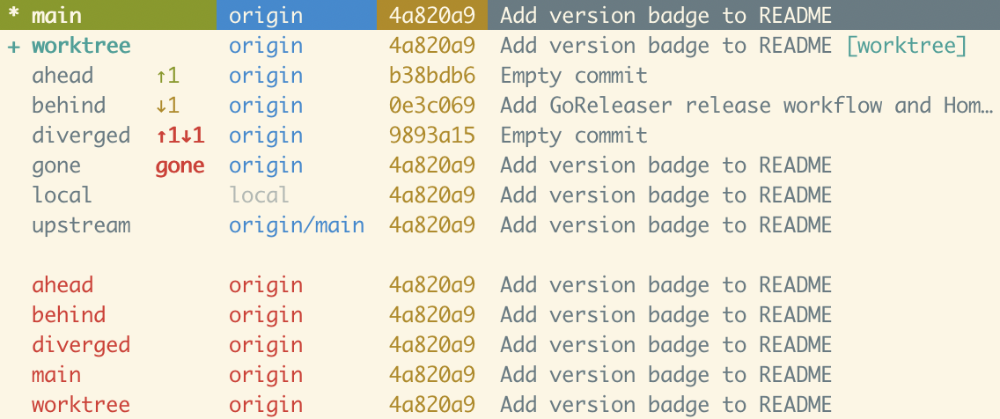
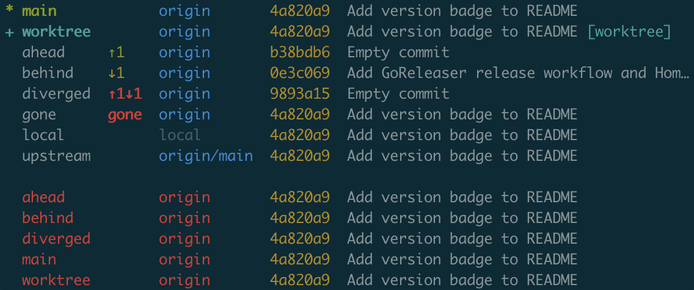
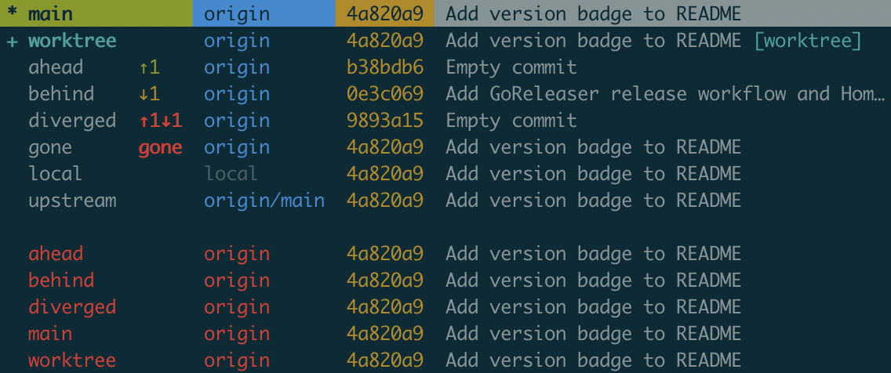

# git-better-branch

[](https://github.com/redodson01/git-better-branch/actions/workflows/ci.yml)
[](https://github.com/redodson01/git-better-branch/releases/latest)
[](https://goreportcard.com/report/github.com/redodson01/git-better-branch)
[](LICENSE)

A better `git branch` viewer for repositories with long branch names, worktrees, and many remotes.

## The problem

<!-- These examples intentionally use this repo's own short branch names rather
     than fabricated long names. Long-name examples look dramatic in a narrow
     editor, but GitHub's code blocks scroll horizontally, so "The solution"
     example just gets truncated — defeating the purpose. The screenshots below
     demonstrate the tool's value with realistic output. -->

`git branch -avv` becomes unreadable when working with long branch names (e.g., ticket IDs), worktree paths, and hundreds of remote branches:

```
  ahead                   b38bdb6 [origin/ahead: ahead 1] Empty commit
  behind                  0e3c069 [origin/behind: behind 1] Add GoReleaser relea
se workflow and Homebrew tap support
  diverged                9893a15 [origin/diverged: ahead 1, behind 1] Empty com
mit
  gone                    4a820a9 [origin/gone: gone] Add version badge to READM
E
  local                   4a820a9 Add version badge to README
* main                    4a820a9 [origin/main] Add version badge to README
  upstream                4a820a9 [origin/main] Add version badge to README
+ worktree                4a820a9 (/Users/rich/Developer/git-better-branch/workt
ree) [origin/worktree] Add version badge to README
  remotes/origin/HEAD     -> origin/main
  remotes/origin/ahead    4a820a9 Add version badge to README
  remotes/origin/behind   4a820a9 Add version badge to README
  remotes/origin/diverged 4a820a9 Add version badge to README
  remotes/origin/main     4a820a9 Add version badge to README
  remotes/origin/worktree 4a820a9 Add version badge to README
```

## The solution

`git better-branch` gives you the same information in a compact, readable format:

```
* main            origin       4a820a9  Add version badge to README
+ worktree        origin       4a820a9  Add version badge to README [worktree]
  ahead     ↑1    origin       b38bdb6  Empty commit
  behind    ↓1    origin       0e3c069  Add GoReleaser release workflow and Hom…
  diverged  ↑1↓1  origin       9893a15  Empty commit
  gone      gone  origin       4a820a9  Add version badge to README
  local           local        4a820a9  Add version badge to README
  upstream        origin/main  4a820a9  Add version badge to README

  ahead           origin       4a820a9  Add version badge to README
  behind          origin       4a820a9  Add version badge to README
  diverged        origin       4a820a9  Add version badge to README
  main            origin       4a820a9  Add version badge to README
  worktree        origin       4a820a9  Add version badge to README
```

<table>
<tr>
<th width="50%">Normal mode</th>
<th width="50%">Interactive mode</th>
</tr>
<tr>
<td></td>
<td></td>
</tr>
<tr>
<td></td>
<td></td>
</tr>
</table>

Features:

- **Smart truncation** of branch names and commit messages to fit your terminal
- **Compact tracking status**: `↑3` (ahead), `↓2` (behind), `↑3↓2` (diverged), `gone`, `local`
- **Tracking remote** shown in its own column; full upstream ref shown only when it differs from the local branch name
- **Worktree indicator**: `+` prefix with `[worktree-name]` tag instead of full absolute paths
- **Remote branches** listed with `-a`, colored red to distinguish from local branches
- **Color-coded** output, automatically disabled when piped
- **Terminal-width aware** column layout
- **Auto-pager** when output exceeds terminal height
- **Interactive mode** (`-i`): TUI branch picker with fuzzy search and checkout

## Installation

### Homebrew (macOS and Linux)

```bash
brew install redodson01/tap/git-better-branch
```

### From source

Requires Go 1.26+.

```bash
git clone https://github.com/redodson01/git-better-branch.git
cd git-better-branch
make install  # installs to ~/.local/bin by default
```

Or specify a different prefix:

```bash
make install PREFIX=/usr/local
```

Ensure the install directory is in your `PATH`.

## Usage

```bash
git better-branch            # local branches
git better-branch -a         # include remote branches
git better-branch -i         # interactive branch picker
git better-branch -i -a      # interactive with remote branches
git better-branch --no-color
git better-branch --version
```

### Passthrough

Flags and arguments not recognized by `git better-branch` are passed through to `git branch`:

```bash
git better-branch -m old-name new-name   # rename a branch
git better-branch -d feature             # delete a branch
git better-branch -v                     # verbose git branch output
git better-branch --sort=-committerdate  # sort by recent commit
```

### Interactive mode

Use the `-i` flag to launch a TUI branch picker:

- **`/`** to fuzzy search (matches branch names and remote names)
- **`j`/`k`** or **`↑`/`↓`** to navigate
- **`g`/`G`** or **`Home`/`End`** to jump to top/bottom
- **`PgUp`/`PgDn`** to scroll by page
- **`Enter`** to checkout the selected branch
- **`d`** to delete a branch (`git branch -d`); **`D`** to force-delete (`git branch -D`) or delete a remote branch
- **`Esc`/`q`** to quit

### Aliases

```bash
# git bb
git config --global alias.bb better-branch

# gbb (shell alias — add to your .bashrc/.zshrc)
alias gbb='git better-branch'
```

## License

[MIT](LICENSE)
